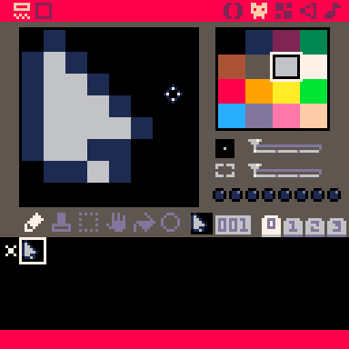
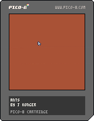

this is part of a [series](/tags/ants). see the [previous post here](/posts/devlog/ants-01)
### ants
now that we have a world, let's create life in it. because we are working with systems it seems imperative we create a model of our life cycle. thus:
```
→ birth
    ↪ struggle
        ↪ death
```

in other words, to create life true to life, we must allow our ants to live, to struggle, and to die. once we have these, we'll have our most basic simulation

> #### notice!
> 
> because struggle is often difficult to represent visually, we will be showing movement in its place

#### birth
but how will we birth our ants? ‘ants’ is of course a generalized term here, little more than metaphor, but if we follow our metaphor as example we open ourselves to a whole complex reproduction apparatus, queens and soldiers and social roles and all, which is more than we are ready to simulate now. we’ll need another way to birth them, with an artificially increased control

a shame: we must reveal ourselves so early

### revealing the creators hand
pico-8 offers optional mouse cursor support. it’s a sort of imitation secret, in that only its implementation seems obscure, its existence is known by most who use the program. also, more relevantly, it seems the perfect way to spawn out ants: use the mouse to select a pixel, click, and bring a single ant to life

to enable the mouse, we need only call the below function somewhere in our program. don’t worry what it means now. the meanings mostly unimportant [^1]
```lua 
 poke(0x5f2d, 1)
```

at least now we have a use for our `_init()` function: to init our cursor. let’s put that at the top of our file:
```lua
function _init()
	poke(0x5f2d, 1)
end
```

try to run it now? does anything happen? no: we need to make our hand

### revealing the creator's hand, pt 2
hi! my name is j konger. its a pseudonym, of course. few parents give their child a single initial name. i  had the idea this devlog would be fun to write in the voice of a tutorial, but the more i write on this the more i realize i need to drill down, explain things neither you or i find very interesting. instead of scrapping this work however (in accordance with my site's [first rule](/rules)), i am changing course into simple narrative. i hope you don't mind.

a shame: we must change our course so early
### cursor
#### code
this is the image i used for my cursor. you'll notice it's the pico 8 cursor almost exactly, with the color changed. we'll get to that later, maybe several posts from now



and this is the code i used to make the cursor follow the mouse, which i put in a separate tab:
```lua
-- cursor

function cur_init()
	cur_spr=1
	cur_x=60
	cur_y=60
end

function cur_draw()
	spr(cur_spr,cur_x,cur_y)
end

function cur_update()
	--mouse loc
	cur_x=stat(32)-1
	cur_y=stat(33)-1
end
```

and, under our main tab, we now have this:
```lua
function _init() 
   -- allow mouse :)
   poke(0x5f2d, 1)
   cur_init()
end

function _draw()
	cls(4)
	cur_draw()
end

function _update60()
   cur_update()
end
```
#### explanation
let's start with that second part of code, as its simplest: for readability, we add a new `init`, `update`, and `draw` function to our cursor, then just call them in the generic version of each. we call this 'separation of concerns'. we call this 'elegant code'

the other tab is simple also, just not as much. let's go function by function, ok? i think that sounds nice:
##### cur_init
here, we just set some defaults. `cur_spr` is the index of our sprite, `cur_x` and `cur_y` the starting position of our cursor, which we add only because we need to call it in...
##### cur_draw
here were merely draw the sprite to screen: `spr()` draws a sprite, and `cur_x` and `cur_y` tell it where to go, x- and y-wise. as we're using the mouse here, we are continuing to use obscurant functions. all we need to know for our purposes is that `stat(32)` returns our cursor's x coordinate, `stat(33)` its y, and that we subtract one pixel distance from each so our cursor points at the coordinate rather than overlaps, thus looking overall more 'real' to our precious user (in truer words 'familiar')

### end
so now we have a hand in our own creation. if nothing else, that’s worthy of our pride. reach out now, with your pointer device of choice, and touch your world. hit `ctl-r` on your keyboard to run the app and watch the cursor move

<details>
<summary>full code and downloads</summary>

#### cartridge 
<small>(right click to save, open in pico-8)</small>



#### full code
```lua
-- ants
-- by j konger

function _init() 
   -- allow mouse :)
   poke(0x5f2d, 1)
   cur_init()
end

function _draw()
	cls(4)
	cur_draw()
end

function _update60()
   cur_update()
end


-->8
-- cursor

function cur_init()
	cur_spr=1
	cur_x=60
	cur_y=60
end

function cur_draw()
	spr(cur_spr,cur_x,cur_y)
end

function cur_update()
	--mouse loc
	cur_x=stat(32)-1
	cur_y=stat(33)-1
end

```

<small>i'd _like_ to have embeds here in a later post, once i figure out how to do that with my static site generator. perhaps that will exist by the time the game gets interesting</small>

</details><br>
<hr><br>

[^1]: ok, you wanna know? [here's the explanation i used to learn it](https://nerdyteachers.com/PICO-8/Guide/?MOUSE)