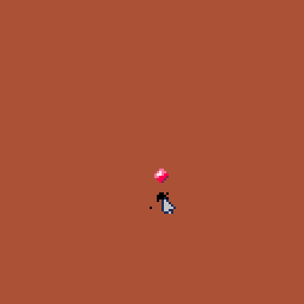

wait, let's make use of the tools given to us by default: here's the [commit for this post's code, on Github](https://github.com/towercity/pico-8/commit/711a188d81fa7a630eace70e9eef84bdbeaa5142)

had i thought on this far enough ahead, perhaps we'd have had a PR with many commits, one for each change, but in that idea's place let's follow a simple three act structure (out of 5, as you will see very soon our work ends with a large and tragic turn)

## act i: setting the scene
before anything else, let's simplify the vars we use in our `ant_move()` code: previously, we referenced our current ant's x and y via their object, but if we want to reference them more often in our movement function, as we plan to, it makes more sense to simplify those to just `x` and `y`. after all, its what we'll mean in this the most

any other code in this area is replacing these vars throughout

## act 2: a tired joke about not wanting to remove bugs
this ones simple, and well worth taking note of. in our `_init()` we added a new variable `debug_text`, set to a blank string, and we end our `_draw()` with a call to print this variable to the screen (at the end, so we know it's always on top of everything). at the moment, we don't add anything to this string, as we've more or less cleaned thing up, but a simple call of `debug_text = debug_text .. "whatever we wanna check on"` keeps our business on the screen. very nice

also: _could_ we loop thru an array of strings to make this easier to add to? who cares! we can still do anything we want to later!

## act three: the actual changes we've made

> #### notice!
>
> this is wrong. this is very wrong. the sensing function we make is incredibly functional, but the way we choose to use it is very wrong. we just gotta pretend it isn't for a bit of narrative. spoiler, howver, this will end up bad

should be simple, right? we have a randomized movement function, let's slot in some new movement types.
under our list of movement options, let's add an elseif and add in a new function for looking nearby

### `find_nearby_dots`
^^ see that up there, that's what we'll be calling our sensing function. interested and detail-oriented readers (of whom, at the time of writing, i have none) will notice this is _not_ in the linked commit. that's cause i messed up rebasing. i have no desire to fix this, so it stands

that said, we can add the function in whole here now:

```lua
function find_nearby_dots(x,y,dist)
   local vals={}

   for i=0,dist-1 do
      local x1,x2=x+dist-i,x-dist+i
      local y1,y2=y+i,y-i

      if(0==i) then
         add(vals, {x1,y1})
         add(vals, {x2,y1})
         add(vals, {y2,x1})
         add(vals, {y2,x2})
      else
         add(vals, {x1,y1})
         add(vals, {x2,y1})
         add(vals, {x1,y2})
         add(vals, {x2,y2})
      end
   end

   return vals
end
```

isn't plaintext wonderful!
the above is essentially nonsense requiring a day or two of doing math (i have an MFA in creative writing), graph paper, highlighters, coordinate writing, refusing to look up answers because I'm doing this to keep my own creative forces occupied, not to make the most technically proper game. i will not be adding these notes to the page as ive moved apartment recently and dont wanna hafta get me scanner out. in place, let's just explain the finished process:

in essense, thru guess-and-check i determined that for each new pixel of distance an ant is able to sense, another four pixels need to be sensed around it. i dont wanna go into the formula because i wrote it about a week ago and have since forgot it, but suffice it to say in the local variable lines at the top of the for loop we add or subtract a specific amount from the passed distance to create four new points of 'vision'. they mirror each other quite well, so we can add them with only a few calculations. as you can see as well, the first loop works a little different in how its mirrored (not how our x and y variables are altered by the loop number: this is what causes this), so we get our points of vision differently

each of these points is added to an array, which is then returned: this is an array of all our senses points

math-brained types might notice this only gives us our outer ring of vision. yep: this only returns our outer ring. this is on purpose, as it adds a bit more flexability: we can use the function to determine what pixels are a certain distance of steps away with this one function or, by calling the function from within a loop, determine all the pixels that distance or less. i like that

(for the moment, imagining myself saving memory wheter I am or not, i'm only looking at the outer ring in code later. but, as shown above, it's an easy change if i'm incorrect)

(also, not how easily this could be re-written to not need an x and y variable: we could simply return a distance amount rather than an absolute pixel. oh well, i realized that when writing this up. maybe, if it ends up convenient, we'll change that later)

### using `find_nearby_dots`

> ####
>
> in this first paragraph here i'm insulting myself a week or so ago for not understanding how my earlier movement system worked. to skip ahead to the explanation, i was not balancing movement well. i was forgetting that my previous randomization took the option of no movement into account to create more jagged, natural seeming motions. this means that while there's still only about a two percent chance to move each cardinal direction, there's now a 92% chance to move toward a sensed food pixel, and no chance to stay put. this means that every frame, of which there are 60 in a second, our ants will move. that's stupid fast, in practice

back to our ant movement functions, _surely_ we can just slot this into our movement functions, right?? _surely_ this is simple. see [line 105](https://github.com/towercity/pico-8/blob/main/ants.p8#L105) in the github, see our local variable to hold these produced sensed squares, `scent_squares`. we've simply added another branch to our movement if statement, which is _surely_ going to add a "more likely" movement choice, in comparison to our 2% chance movements from before

we use our loop pixels function to loop thru the sensed pixels we've gathered and check: is it food? if so, we move towards it, prefering vertical movement over horizontal for the sole reason that i use the computer on my phone a lot, so i imagine computer screens as intrinsically tall.

by the way, does this function move us multiple times each way as written? i think so. i haven't tested this out visually for reasons we'll explore below

### stop fucking around, show me why this sucks


see that? we move too many times per second. its one thing to swarm. this is something else

for next time, we'll look into refactoring our movement decision code, so we can fix this
