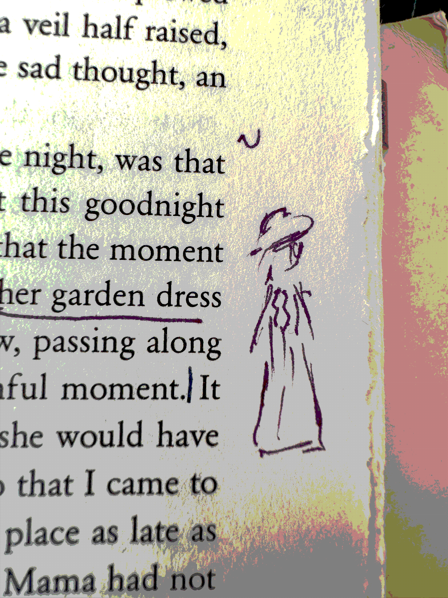

i've always drawn pictures in the margins of my books. dont know why. not gonna analyze. i've been trying to read proust in french this year, and as i go, checking translations again in english, i been seeing images

so: i am gonna upload them here. keep this page bookmarked. it can _only_ be good.

## mama in her garden dress
<small>vol 1, p13</small>

---
translations read
1. Swann's Way: Lydia Davis translation, US version
